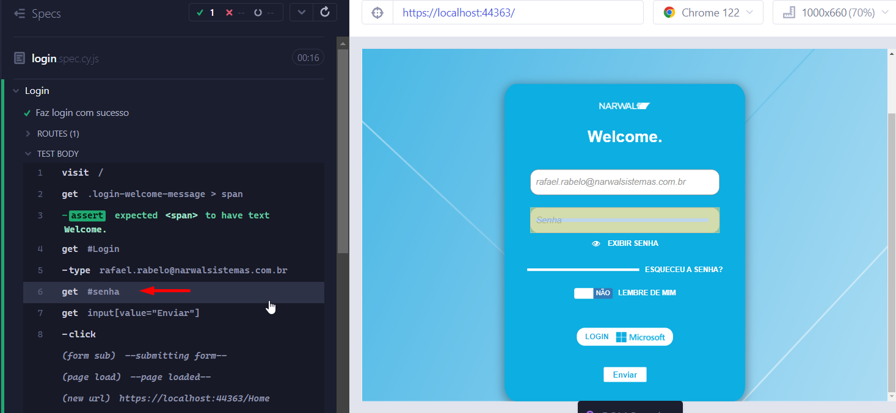
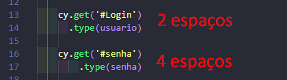
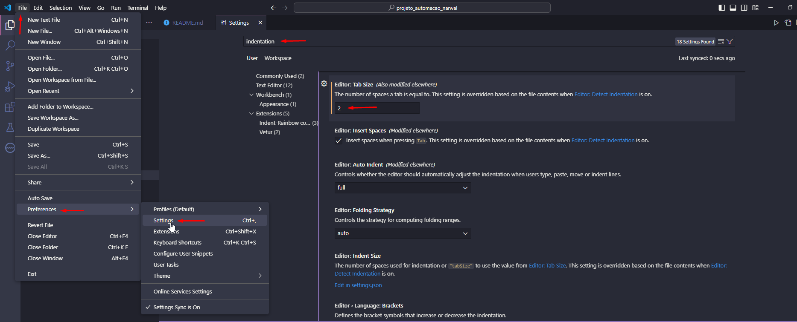

# O projeto ✨

Este projeto visa automatizar testes no sistema Narwal 🐋 utilizando o framework Cypress.

# Sumário 📚

- [Dependências do projeto](#dependências-do-projeto-🛠️)
- [Padronização e proteção do código](#padronização-e-proteção-do-código-🔦)
- [Lista de Comandos](#lista-de-comandos-🧙‍♂️)

# Dependências do projeto 🛠️

Este projeto utiliza as seguintes dependências:

* Cypress: Framework para automação de testes

Ao abrir o projeto pela primeira vez, execute o seguinte comando para instalar as dependências: 

`$ npm install`

> 💡 Certifique-se de ter o Node.js e o npm instalados na sua máquina antes de executar este comando. Essa ação garantirá que todas as dependências necessárias sejam instaladas e o projeto esteja pronto para execução.

Para abrir a interface do Cypress basta digitar o comando abaixo no terminal:
`$ npx cypress open`

# Estrutura base dos cenários

No exemplo abaixo, 'Xxxx' seria substituído por uma descrição significativa do que está sendo testado. Por exemplo, se você estiver testando um formulário de login, poderia ter algo como 'Teste de login'. Dentro deste describe, você teria vários its, cada um testando um aspecto específico do login, como 'Deve permitir o login com credenciais válidas', 'Deve exibir uma mensagem de erro para credenciais inválidas', etc. Isso ajuda a manter seus testes organizados e fáceis de entender.

```javascript
describe('Xxxx', () => { // Descrição do conjunto de testes (suíte de testes)
  it('Xxxx', () => { // Descrição de um teste específico (caso de teste)
    
  })
})
```

# Padronização e proteção do código 🔦

1. Proteção de Dados Sensíveis

  Por questões de segurança, é crucial evitar a exposição de dados sensíveis. Recomenda-se o uso da opção `{ log: false }` ao realizar a entrada de informações, garantindo que nenhum log seja exibido durante a execução no modo interativo do Cypress.

  ```javascript
  cy.get('#senha').type(senha, { log: false })
  ```
    
  

2. Padronização dos nomes de componentes:

  - Botão: btn;
  - Input: ipt;
  - ComboBox: cmb;
  - Link: lnk;
  - Imagem dos ícones: img;
  - Grids: grd;

3. Padronização dos comandos customizados (Custom commands)

Os comandos customizados do Cypress devem seguir a escrita Camel Case como no exemplo abaixo:

```javascript
Cypress.Commands.add('fazLogin', () => {
    //Código
})
```

4. Escrita em Camel Case: 

  É recomendado o uso da prática Camel Case para a escrita de variáveis, métodos, comandos e nomes de elementos da página. Exemplo: btnCadastrar, lnkPerfil.

5. Identação

  Para garantir a consistência do código, ajuste a indentação no Visual Studio Code para um tab com 2 espaços. Isso proporciona alinhamento adequado ao separar comandos com a tecla "Enter". 

  Na imagem abaixo observa-se que ao utilizar 2 espaços, o `.type` está alinhado corretamente com o `.get`, enquanto que ao utilizar 4 espaços, ocorre um desalinhamento entre o `.type` e o `.get`.

  


**Passos para configuração ⚙️**

  1. Acessar o menu `Settings` no Visual Studio: `File > Preferences > Settings`.
  2. No campo de busca digitar: "indentation".
  3. Encontrar o campo "Editor: Tab Size" alterar o valor para "2".

      

# Lista de Comandos 🧙‍♂️

Na [documentação oficial do Cypress](https://docs.cypress.io/api/table-of-contents), você encontrará uma lista completa de comandos disponíveis para utilização no projeto.

Abaixo alguns comandos úteis para lidar com a manipulação de datas:

* Utilizar data atual em um input

  ```
  var data = new Date();
  cy.get(elemento ipt).type(data.toLocaleDateString())
  ```

* Utilizar data de ontem em um input

  ```
  var data = new Date();
  data.setDate(data.getDate() - 1)
  cy.get(elemento ipt).type(data.toLocaleDateString())
  ```

* Utilizar data de amanhã em um input

  ```
  var data = new Date();
  data.setDate(data.getDate() + 1)
  cy.get(elemento ipt).type(data.toLocaleDateString())
  ```